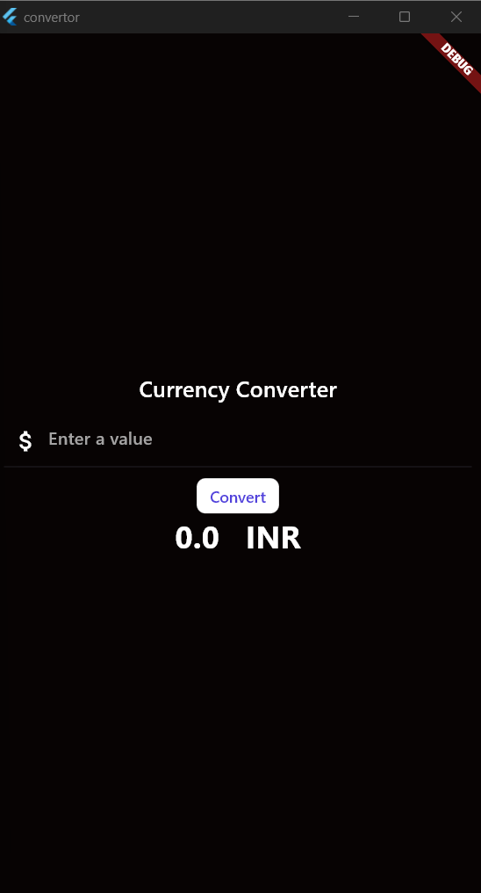
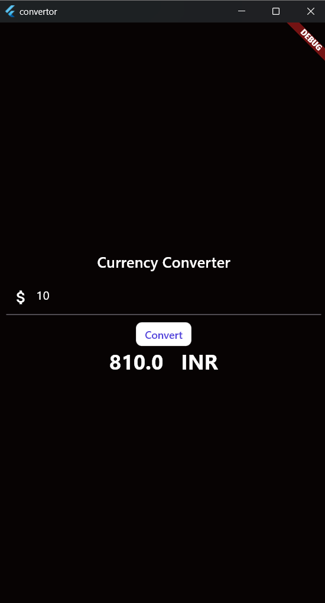

# Currency Converter App

This is a basic currency converter app built using Flutter. It is a simple app that allows users to convert currency values. This is my first Flutter app.

## Features

- Convert currency values
- Simple and easy-to-use interface


## Sample Output

Here are some sample outputs from the app:
<p align="center">
    
    
</p>


## Getting Started

To get started with this app, follow these steps:

1. **Clone the repository:**
```bash
git clone https://github.com/yourusername/currency_converter.git
```

2. **Navigate to the project directory:**
```bash
cd currency_converter
```

3. **Install dependencies:**
```bash
flutter pub get
```

4. **Run the app:**
```bash
flutter run
```

## Code Overview

The app is structured as follows:

- `lib/main.dart`: The main entry point of the app.


### `lib/main.dart`

```dart
import 'package:convertor/currency_home.dart';
import 'package:flutter/material.dart';

void main() {
  runApp(const MyApp());
}

class MyApp extends StatelessWidget {
  const MyApp({super.key});
  @override
  Widget build(BuildContext context) {
    return const MaterialApp(
      home: CurrencyHome(),
    );
  }
}
```

### `lib/currency_home.dart`

```dart
import 'package:flutter/material.dart';
import 'package:flutter/services.dart';

class CurrencyHome extends StatefulWidget {
  const CurrencyHome({super.key});
  @override
  _CurrencyHomeState createState() => _CurrencyHomeState();
}

class _CurrencyHomeState extends State<CurrencyHome> {
  double value = 0;
  final TextEditingController textEditingController = TextEditingController();
  @override
  Widget build(BuildContext context) {
    return Scaffold(
      backgroundColor: const Color.fromARGB(32, 56, 23, 23),
      body: Center(
        child: Column(mainAxisAlignment: MainAxisAlignment.center, children: [
          const Text(
            'Currency Converter',
            style: TextStyle(
                color: Colors.white, fontSize: 20, fontWeight: FontWeight.w500),
          ),
          Padding(
            padding: const EdgeInsets.all(10.0),
            child: TextField(
              inputFormatters: [FilteringTextInputFormatter.digitsOnly],
              controller: textEditingController,
              cursorColor: Colors.white,
              style: const TextStyle(color: Colors.white),
              showCursor: true,
              decoration: const InputDecoration(
                hintText: 'Enter a value',
                hintStyle: TextStyle(color: Color.fromARGB(255, 164, 163, 163)),
                prefixIcon: Icon(
                  Icons.attach_money,
                  color: Colors.white,
                ),
                focusedBorder: OutlineInputBorder(
                  borderSide: BorderSide(color: Colors.white),
                  borderRadius: BorderRadius.all(Radius.circular(10)),
                ),
              ),
              keyboardType: TextInputType.number,
            ),
          ),
          TextButton(
            style: ButtonStyle(
              backgroundColor: MaterialStateProperty.all(Colors.white),
              shape: MaterialStateProperty.all(
                RoundedRectangleBorder(
                  borderRadius: BorderRadius.circular(8.0),
                ),
              ),
            ),
            onPressed: () {
              setState(() {
                value = double.parse(textEditingController.text) * 81;
              });
            },
            child: const Text(
              'Convert',
              style: TextStyle(
                color: Color.fromARGB(255, 82, 67, 219),
              ),
            ),
          ),
          Text(value.toString() + '   INR',
              style: const TextStyle(
                color: Colors.white,
                fontWeight: FontWeight.bold,
                fontSize: 28,
              ),
              textAlign: TextAlign.center)
        ]),
      ),
    );
  }
}

```


### License

This project is licensed under the MIT License. See the [LICENSE](LICENSE) file for more details.
